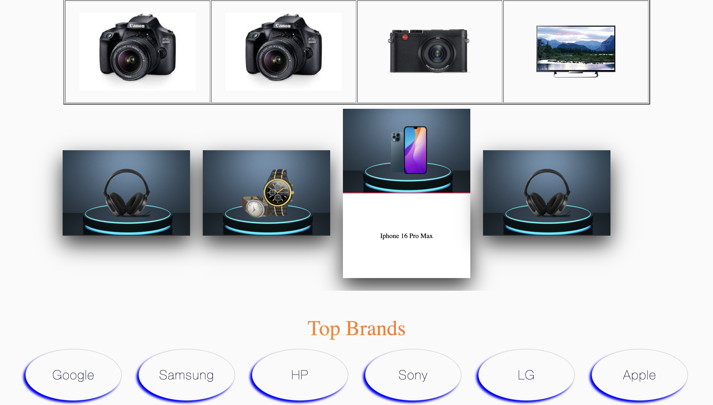

# WebD Project

A responsive and visually engaging front-end web project built using HTML, CSS, and JavaScript. This project showcases a dynamic landing page layout with interactive elements and modern UI components.


## 📁 Project Structure

```

webD/
│
├── index.html              # Main entry point
├── footer.html             # Footer component
├── style.css               # Stylesheet
├── script.js               # JavaScript logic
├── productData.json        # Sample product data (optional)
├── assets/ or images/      # Various image assets

````

## 🚀 Features

- Responsive design layout
- Product cards and image carousels
- Hot deals and flash sale sections
- Embedded iframe content
- Reusable components (`footer.html`)
- Interactive elements via JavaScript

## 🛠️ Tech Stack

- HTML5
- CSS3
- JavaScript (Vanilla)
- [Optional] JSON (for dynamic data)

## 📦 Installation

To run this project locally:

```bash
git clone https://github.com/<your-username>/<your-repo-name>.git
cd webD
````

Then, simply open `index.html` in your browser:

```bash
start index.html  # Windows
open index.html   # macOS
```

## 🖼️ Screenshots

### 🔸 Home Page


### 🔸 Products Section



## 🧑‍💻 Author

**Saransh Bhargava**

## 📝 License

This project is open source and available under the [MIT License](LICENSE).
